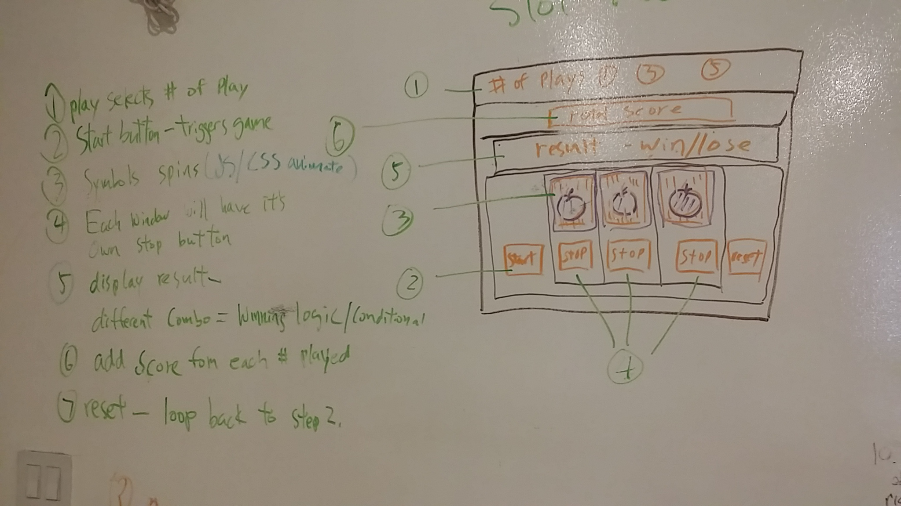
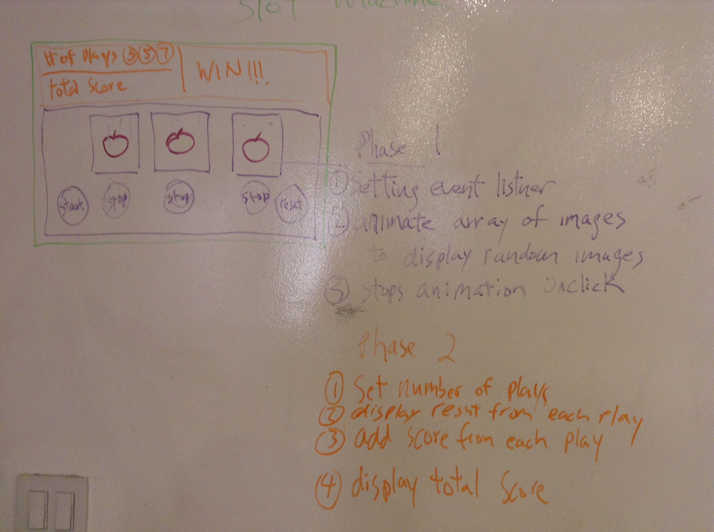

# Project 1- Slot Machine

## Original Whiteboard

## project in two Phases

###Concept
- I tried to take things we have covered in class and implemented in the first project.

###Project was diveded into two phases.
- First phase is consist of basic working function(MVP) start button, stop button, displaying  random images.
- Second Phase is additions/extensions getting player input, adding and displaying total score.

###Technologies Used

####HTML
- Semantics tags

####Javascript 
- On click event listener
- Randomize arrays of images
- Game winning conditional

####CSS
- Flexbox
- Absolute/Relative postioning

#####Jquery
- $Selectors

###Unsolved problems
- Did not get to phase 2.
- Couldn't get the submit button in the landing page to work. Had to resort to a inline href tag

