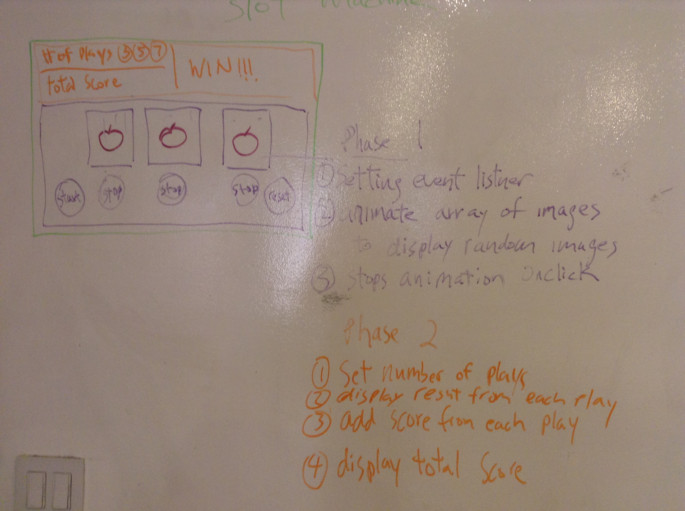

*** Name / Date ***

# [Name of Game] Proposal

## What is [name of game]?

##Slot machine

The slot maching game have a winning condition similar to tictactoe.
The winning condition be be base on matching symbols.

The basic layout will be consisted of buttons( start, stop and reset)and 3 windows displaying symbols. The windows will be activiated / animate upon pressing the start button. player will then press the stop button to stop the animation. The score will be based on the combination of symbols displaying once the symbols stop.

## Initial thoughts on game structure

(Write out what challenges you expect to encounter, or ideas you want to come up with)

The biggest challenge would be animating the window with different symbols.

## Phases of Completion

(The steps or phases you expect to go through, and the tasks that you'll need to accomplish to reach each step. These should resemble the acceptance criteria we were working through earlier.)

Game will have 
Start Button- symbols will spin on click
Stop Button- stops the spinning and display randomize combination
Reset button- set to default
Display message- win or lose logic (match 3 symbols or 2 or none)

If it’s multiple play game- will add up the score of each play and display final score.

## Links and Resources

(Anything you've looked up so far or are thinking about using.)
CodePen- https://codepen.io/tag/slot%20machine/ 
